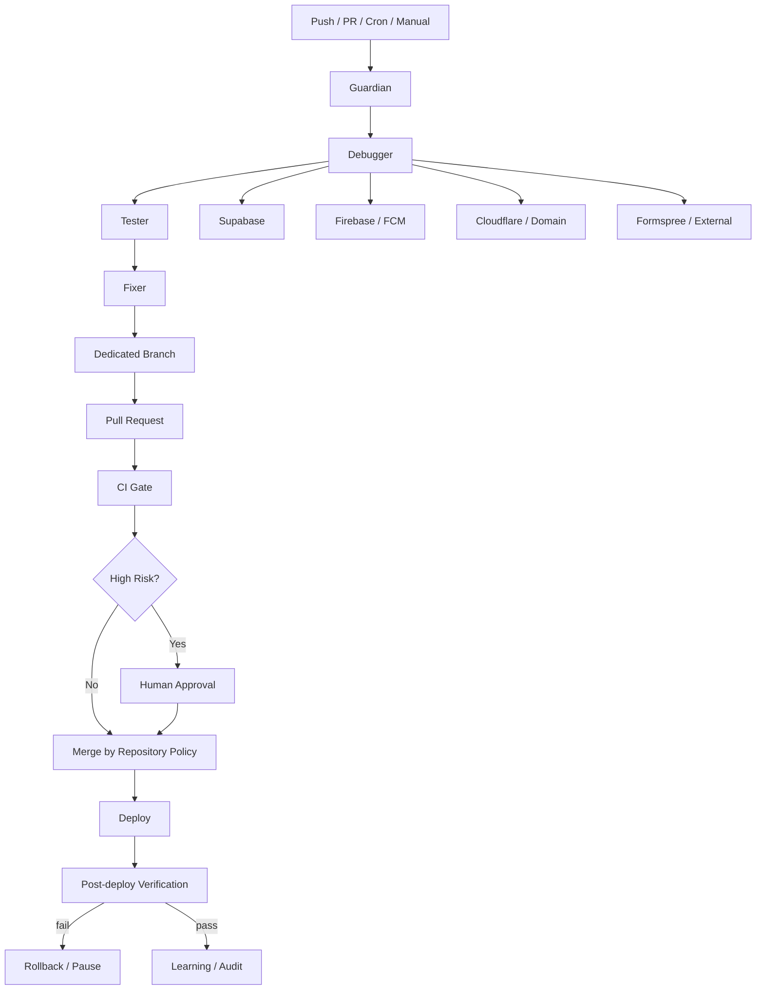

# Stagepulse Autonomous Guardian

## Production impact rule

Every proposed change records whether it can affect production. Diagnostic runs are read-only. Production mutations are never performed by the Guardian workflow itself.

## FCM chain

`HTTPS -> permission -> service worker -> Firebase SDK -> Installations -> FCM registration -> VAPID -> token -> Supabase RPC -> notification_devices`

The browser diagnostic in `portal/fcm-register-v3.js` exposes the first failing stage and a CORS/network probe without logging secrets.
